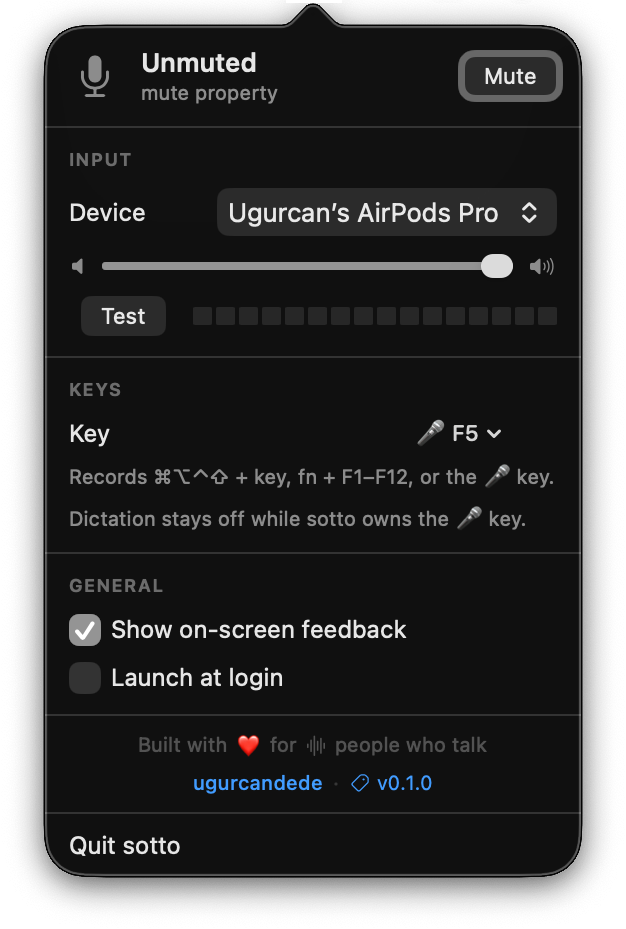
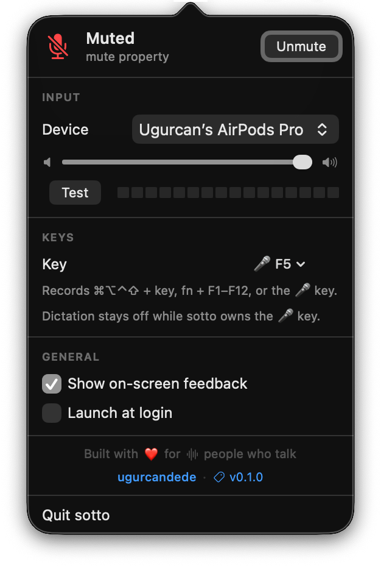
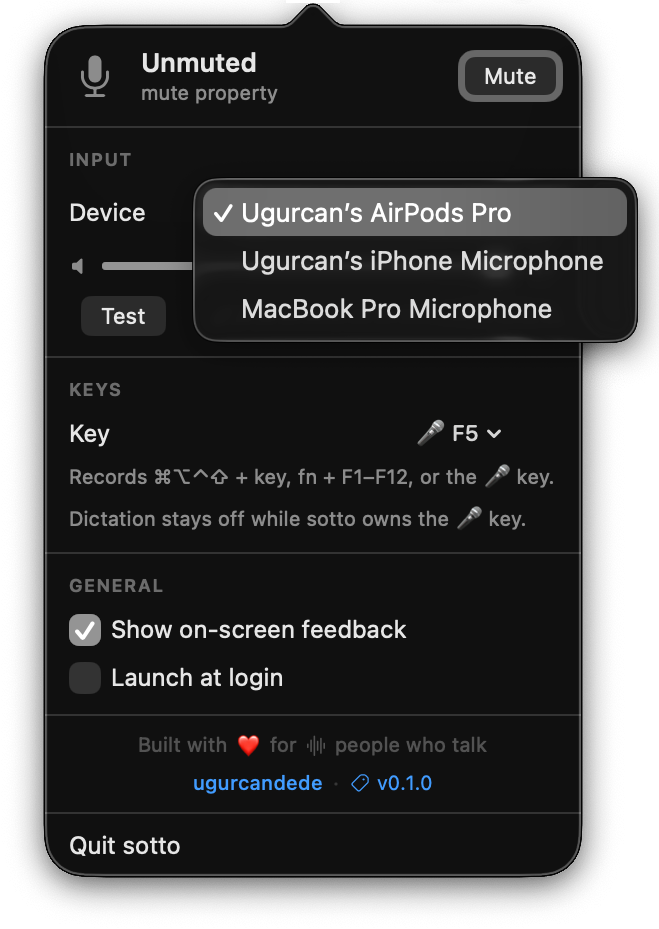
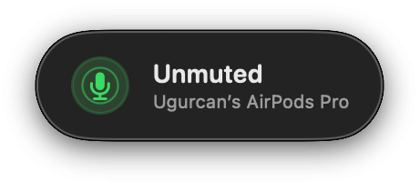
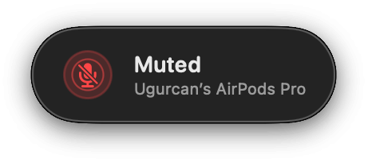

<div align="center">
  
  <h1>sotto</h1>
  <p>Menu bar app to mute your microphone system-wide, with hold-to-talk and an icon you can trust.</p>
  <br>
  <a href="https://github.com/ugurcandede/sotto/releases/latest"></a>
  <a href="https://github.com/ugurcandede/sotto/actions/workflows/build.yml"></a>
  <br>
  
  
  <a href="LICENSE"></a>
</div>

> [!WARNING]
> **Early release.** Tested on built-in microphones and AirPods — if yours
> behaves differently, please [open an issue](https://github.com/ugurcandede/sotto/issues).

---
#### Releated
<p style="text-align: center">
  <a href="https://ugurcandede.github.io/sotto"></a>
  <a href="https://github.com/ugurcandede/homebrew-tap"></a>
</p>

---

## Install

```bash
brew tap ugurcandede/tap
brew install --cask sotto
```

It works the moment it launches — **no permissions required**.

---

## Features

| | Feature |
|---|---|
| 🎙️ | **Mute system-wide** — one click on the menu bar icon, or a global shortcut |
| 🔴 | The icon reads the device, not the app — it can't lie about your state |
| 🎚️ | Switch input device, set gain and test your level from the menu |
| 🚀 | Launch at login |

---

## Screenshots

<div align="center">

| Menu | Muted | Input devices |
|:---:|:---:|:---:|
|  |  |  |

**On-screen feedback**

|  |  |
|:---:|:---:|

</div>

---

## How it works

Mute is a single piece of state, and it lives on the device rather than in the
app. sotto reads it on launch, writes it when you ask, and follows it when
something else changes it.

Push-to-talk is modelled but not shipped: holding a key means seeing key-up,
which only an event tap reports, and that needs Input Monitoring. The state
model already carries it as `effectiveMute = baseMuted XOR holdActive` so
turning it on later changes the UI, not the core.

### Permissions

| Feature | Mechanism | Permission |
|---|---|---|
| mute / unmute | CoreAudio property write | none |
| toggle shortcut | Carbon `RegisterEventHotKey` | none |
| level test | `AVAudioEngine` | Microphone, only while testing |

sotto installs and runs without ever asking for anything. The microphone key
(F5) can drive it too: sotto remaps it below the Dictation shortcut with
`hidutil`, which needs no permission either.

Push-to-talk is not in this release. It needs `CGEventTap` — the only API that
reports key-up — and that means Input Monitoring.

### Menu bar icon

| Icon | Meaning |
|---|---|
| `mic` | your microphone is live |
| `mic.slash`, red | muted |
| `mic.badge.xmark` | this input device can't be muted |

Every state change pulses the icon twice, then settles. The glyph is driven by
CoreAudio property listeners, so a change made in System Settings or another
app shows up within a second.

---

## Build from source

Requires Swift 6.0+.

```bash
git clone https://github.com/ugurcandede/sotto.git
cd sotto
swift build -c release
./scripts/bundle.sh .build/release/sotto
open sotto.app
```

`scripts/bundle.sh` wraps the executable in an `.app` with `Info.plist` and
ad-hoc signs it. The bundle is what makes the menu bar item, the login item and
the version string work — the raw binary alone won't do.

---

## Requirements

macOS 14.0 (Sonoma) or later · Apple Silicon or Intel · no permissions

## License

Source Available — free to use, not to modify or redistribute. See [LICENSE](LICENSE).
